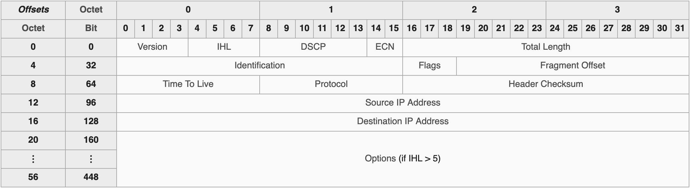

# Internet Protocol (IP) and the Protocol Stack

Before diving into the basics of socket programming, we have to make sure we understand the ecosystem that sockets live in, namely the way in which computers communicate with each other over a _network_. 

Machines and programs that send messages or **datagrams** _over the wire_ are formatted and appended by a series of protocols (i.e. a set of rules or communication guidelines that two or more machines agree on using). These protocols can be understood as a _stack_.

## Sending a postcard: 
Suppose a man named Shevek wants to send a post card from his trip to Urras to his friend Takver on Anarres. The success of his postcard arriving at its destination depends on the set of rules that all parties in charge of transporting and delivering the letter agree on. 

```
From: Shevek
Address: Ieu Eun University
City: Nio Esseia        
Planet: Urras

To: Takver
Address: Fish Laboratory
City:  Abbenay
Planet: Anarres
```

The ones responsible for getting Shevek's post card will first look at the Planet destination. This tells the transporter that the postcard must be routed to the space terminal and get on board a ship. Which ship depends on the _city_ destination. If it's on the other side of the planet, maybe a different vessel would be needed. Once on the planet and arrived in the right city, the transporter looks at the address and routes the postcard to its final destination. A receptionist at the Fish Lab looks at the name and places the postcard in the hand of Takver. 

Furthermore, Takver has told the receptionist that she only wants to receive messages from Urras if they are directly sent by Shevek. Other postcards or letters are simply thrown into the recycling.

All of the fields follow specific rules that ensure Shevek's postcard arrive at its intended destination. Each field of this line can be understood as its own protocol layer. Though this is a _very_ simplified analogy of how the network protocol suite functions, we can easily start to imagine more complex protocols used for communication between these two planets. Perhaps Shevek is sending multiple letters that need to be read _in order_. Suppose these messages become mixed up, some slowed down by a ship delay, or maybe one is lost entirely. Adding an order like `Letter 1 out of 3` would help. Or maybe a timestamp when the letter is first sent. Perhaps Shevek and Takver want all their communication to be private, away from the prying eyes of the Urrasti _Propertarians_. They could both agree on a _cypher_ or key they can use to decrypt and interpret each other's messages. The TCP/IP suite reflects the evolution of communication techniques like these. 

## Internet Protocol

The first protocol we'll look at is IP or Internet Protocol. IP was designed decades ago to connect two computers together over a network.

IP is a Network Layer Protocol. Each layer of the network stack attaches headers to the message/datagram being sent. The transport layer attaches several, but most importantly adds an IP address. This can be thought of, simply, as an address where a message is routed to, similar to Takver's Fish Labs. These addresses are in [a language that computers can read](https://en.wikipedia.org/wiki/IP_address). Let's have a closer look at the IP packet header:


_source: wikipedia_

The most important header in the transport layer is _port number_. A port number defines a specific process or network service to a 16-bit unsigned integer. 

## UDP
🚧 TODO 🚧
## TCP
🚧 TODO 🚧

Sources: 
https://www.youtube.com/watch?v=C7CpfL1p6y0


