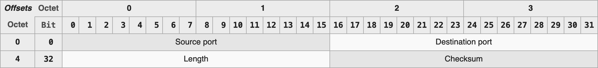
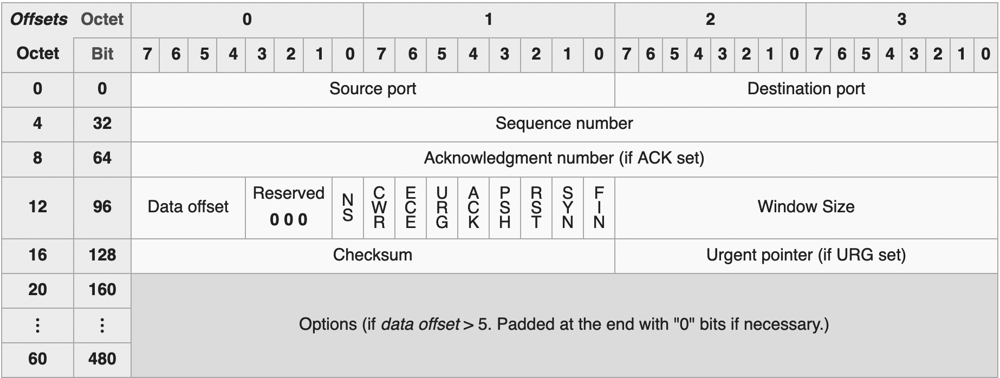

# Internet Protocol (IP) and the Protocol Stack

Before diving into the basics of socket programming, we have to make sure we understand the ecosystem that sockets live in, namely the way in which computers communicate with each other over a _network_. 

Machines and programs that send messages or **datagrams** _over the wire_ are formatted and appended by a series of protocols (i.e. a set of rules or communication guidelines that two or more machines agree on using). These protocols can be understood as a _stack_.

## Sending a postcard: 
Suppose a man named Shevek wants to send a post card from his trip to Urras to his friend Takver on Anarres. The success of his postcard arriving at its destination depends on the set of rules that all parties in charge of transporting and delivering the letter agree on. 

```
From: Shevek
Address: Ieu Eun University
City: Nio Esseia        
Planet: Urras

To: Takver
Address: Fish Laboratory
City:  Abbenay
Planet: Anarres
```

The ones responsible for delivering Shevek's post card will first look at the Planet destination. This tells the transporter that the postcard must be routed to the space terminal and get on board a ship. Which ship depends on the _city_ destination. If it's on the other side of the planet, maybe a different vessel would be needed. Once on the planet and arrived in the right city, the transporter looks at the address and routes the postcard to its final destination. A receptionist at the Fish Lab looks at the name and places the postcard in the hand of Takver. 

Furthermore, Takver has told the receptionist that she only wants to receive messages from Urras if they are directly sent by Shevek. Other postcards or letters are simply thrown into the recycling.

All of the fields follow specific rules that ensure Shevek's postcard arrive at its intended destination. Each field of this line can be understood as its own protocol layer. Though this is a _very_ simplified analogy of how the network protocol suite functions, we can easily start to imagine more complex protocols used for communication between these two planets. Perhaps Shevek is sending multiple letters that need to be read _in order_. Suppose these messages become mixed up, some slowed down by a ship delay, or maybe one is lost entirely. Adding an order like `Letter 1 out of 3` would help. Or maybe a timestamp when the letter is first sent. Perhaps Shevek and Takver want all their communication to be private, away from the prying eyes of the Urrasti _Propertarians_. They could both agree on a _cypher_ or key they can use to decrypt and interpret each other's messages. The TCP/IP suite reflects the evolution of communication techniques like these. Similar to the information on Shevek's envelope, each datagram or _packet_ contains a complexity of accopanying _headers_ that, in short, help the data get _where it needs to go_.

## Internet Protocol

The first protocol we'll look at is IP or Internet Protocol. IP was designed decades ago to connect two computers together over a network.

IP is a Network Layer Protocol. Again, each layer of the network stack attaches headers to the message/datagram being sent. The transport layer attaches several, but most importantly adds an IP address. This can be thought of, simply, as an address where a message is routed to, similar to Takver's Fish Labs. These addresses are in [a language that computers can read](https://en.wikipedia.org/wiki/IP_address). Let's have a closer look at the IP packet header:


_source: wikipedia_

- **Version**: First 4 bits of the header. Simply _identifies which version of the internet protocol we're using_. Most of the time this will be `4` for IPv4. But could also be `6` for IPv6.
- **DSCP** (a.k.a. _Type / Quality of _Service): Simply put, specifies if we want reliability or speed. 
- **Time to Live**: A counter that specifies a _hop count_. If this reaches zero before reaching the intended destination, the router discards the packet. 
- **Header Checksum**: A guard against simple bit errors. All of the bites of the header are added together, the sum is stored into this field to ensure all of the data is contained in the header. 
- **Source / Destination IP Address:** In IPv4, this is a 32 bit address. Read by humans as four separate numbers like `127.0.0.1` but translated into binary this would read `0x7F 0x00 0x00 0x01`
- **Options**: Attach additional data to a packet, such as security.

Continue reading about [IPv4](https://en.wikipedia.org/wiki/IPv4) or [IPv6](https://en.wikipedia.org/wiki/IPv6_packet) headers.

The Internet Protocol is _Best Effort_ Delivery, which means order of packets is not guaranteed. This is handled by higher level protocols. 

## UDP
UDP or _User Datagram Protocol_ lives in the _transport layer_. In memory, UDP directly proceeds IP. Let's have a look at an example UDP header:


_source: wikipedia_

The most important header in the transport layer is _port number_. A port number defines a specific process or network service to a 16-bit unsigned integer. From an IP address we can determine which device sent / received the packet, but a port number determines the _application_. 

## Transmission Control Protocol (TCP)
Designed to make sure all data is received and is _in order_. Breaks message up into segments and attaches headers to each one. For example the sequence header (_seq_), which lets the receiver know the order in which the packets are to be received. 
- Uses a state machine that tracks whether or not a machine is connected to another. The states depend whether or not the machine is a server or a client. 

Client States:
1. Begin as `CLOSED`
2. To initiate a connection, client sends a `SYN` signal (a bite that goes in front of the first bite of data you want to send). Client moves to `SYN-SENT` state
3. When client receives the `SYN-ACK` signal it sends its `ACK` signal and moves to `ESTABLISHED` state. 

Sever States:
1. Begin as `CLOSED`
2. Servers are passive. When a connection opens it moves to `LISTEN` state. 
3. Once a `SYN` packet is received it moves to `SYN-RCVD` state and sends `SYN-ACK` to client. 
4. Once the server receives the `ACK` signal, it moves to `ESTABLISHED`

Closing a connection:
Either the server or the client can close the connection. To initialize a closed connection either party sends a `FIN` signal, then moves to `FIN-WAIT-1` state. 

Once `ACK` is received by closer moves to `FIN-WAIT-2`, then sends its own `ACK` signal. Then moves to `TIME-WAIT` status. Once the timeout is finished closer moves to `CLOSED` status. 

When a machine _receives_ a `FIN` signal (instead of sending one itself) it will send an `ACK` signal and move to `CLOSE-WAIT` status until the party sends `FIN`. Then moves to `LAST-ACK` until a final `ACK` is received from the other end. 

## TCP Headers

_source: wikipedia_

_Now that we've become familiar with the basics of TCP/UDP network protocols, we can dive in and start coding. Navigate to the [next section](2-socket-basics.md) to have a look at the sockets API!_

## Attribution
Wikipedia, [Rhymu's Introduction to TCP/IP and Sockets](https://www.youtube.com/watch?v=C7CpfL1p6y0)


